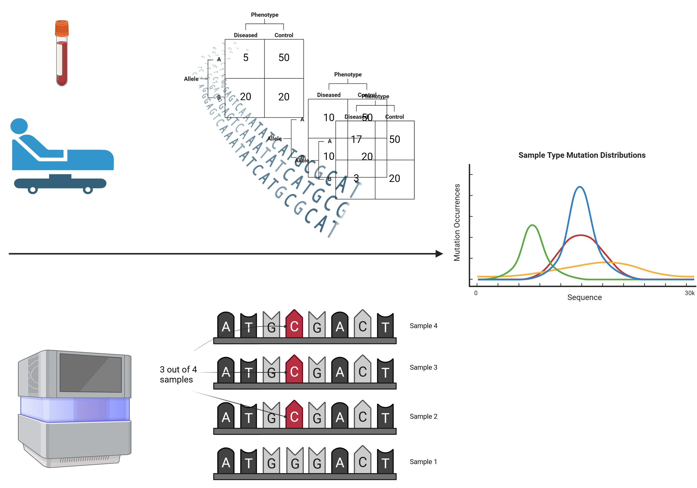

<!-- README.md is generated from README.Rmd. Please edit that file -->

```{r, include = FALSE}
knitr::opts_chunk$set(
  collapse = TRUE,
  comment = "#>",
  fig.path = "man/figures/README-",
  out.width = "100%"
)
```

# PhenoGenRLib

An easy way to study associations between single-nucleotide polymorphisms and phenotypic traits given a dataset of variants.

<!-- badges: start -->
<!-- badges: end -->

---

The goal of PhenoGenRLib is to simplify nucleotide variant analysis. As next generational sequencing (NGS) begins taking off, more and more data is readily available to be used. As a direct product of the growing popularity of the new machine, there is an increasing amount of data that has yet been used to it's fullest potential. 

PhenoGenRLib promises to provide simple ways of loading [variant call format (VCF)](https://en.wikipedia.org/wiki/Variant_Call_Format) files, a commonly used bioinformatics file format capable of storing all forms of variants given a sequence. The format is also quite extensible capable of generalized metadata storage. linking them with sample metadata, and lastly, running associative studies by applying the metadata. Furthermore, PhenoGenRLib contains simple functions for rapidly resolving for rsIDs based of the human chromosome and position and fetching from the National Center for Biotechnology Information (NCBI) Entrez portal.

The package is developed under the following environment:

- R version 4.3.2 (2023-10-31)
- Platform: x86_64-conda-linux-gnu (64-bit)
- Running under: Ubuntu 22.04.3 LTS

## Installation

You can install the development version of PhenoGenRLib like so:

```{r Install Package}
install.packages("devtools")
devtools::install_github("RealYHD/PhenoGenRLib", build_vignettes = TRUE)
library("PhenoGenRLib")
```

To run the shiny app:

```{r Run Shiny App, eval=FALSE, include=TRUE}
PhenoGenRLib::runPhenoGenRLib()
```


## Overview

To browse package functions, peruse the packaged data, or look at the vignettes
respectively:

```{r eval=FALSE, include=TRUE}
ls("package:PhenoGenRLib")
data(package = "PhenoGenRLib")
browseVignettes("PhenoGenRLib")
```

PhenoGenRLib currently contains 8:

- ***linkVariantsWithMetadata*** Takes in a CSV containing a list of VCF files 
along with associated metadata for the case that produced the said VCF. 
Generates a data frame with all variants known merged with the associated 
metadata.
- ***mapRsidsForVariants*** Takes a data frame containing VCF headers as columns
and fetches RSID matches from BioMaRt based on position and reference allele.
- ***varianceCCAnalysisPheno*** Takes a data frame containing variants and 
some phenotype. Automatically performs Fisher's exact test on different allelic
pairings between the reference allele and all alternate alleles for a given
position. Returns results and P-Values as another data frame.
- ***varianceCCAnalysisEnsembl*** Similar to the previous, but instead of a
defined phenotype column found in the dataset, treats the entire dataset as
the case in a case control study and employs the Ensembl database as control.
- ***generate2WayFromMxN*** Given a MxN table in the form of a data frame,
generates all combinations of rows and columns to form the various 2x2 matrices.
Returns a list of 2x2 data frames.
- ***multipleAssociationTests*** Given a list of 2x2 data frames, runs either
Fisher's exact tests or Chi-Square tests on each and generates a data frame of
results.
- ***generatePositionHeatmap*** Generates a heatmap data frame where two columns
for each A, T, C and G are produced. One of the two columns for each is the
reference and the other is the alternate. The values in each cell represent the
number of alleles that is the base defined by the column name, at the position
given by the row name. Such a data frame is returned.
- ***visVariantHeatMap*** Generates a `ggplot2` plot with the different
frequencies of the alleles plotted out. The alleles to be lumped together may be
specificed manually. The reference frequency is coloured in blue and the 
alternate allele frequency is coloured in red. The plot is also returned for
convenience.




By taking Next-Gen Sequencing (NGS) data and calling the variants, a large 
abundance of variants potentially associated with phenotypes are made available.
This package automates the creation of the individual statistical tests and
organizes them (figure generated by BioRender).

# Contributions

PhenoGenRLib stands on the shoulder of giants, and it would be a disservice to 
not name them:

- Thank you Syed Haider et al. for providing bedr. It was greatly helpful in 
simplifying the data ingress features.
- Thanks to the entire Biomart Team for providing an awesome and easy to use 
interface to large public databases!
- ggplot2 was very helpful in generating figures. Thanks to Wickham et. al!
- This entire project wouldn't have been possible without the help of the 
TidyVerse team. Despite not using every single package from their library, much 
work and diagnostic made use of their tools.
- stringr, dplyr, and readr, by Wickham et al. were all used for variety of 
simple operations that are not intuitive in base R. Thanks!
- Chang et al. blessed the R community with Shiny, allowing for previously
potentially inaccessible software to be made trivial to use. Thanks!
- Xie et al. Wrote a neat little library known as DT which made interactive
data frames in Shiny applications easy.
- Perrier et al. created the ShinyWidgets extension to shiny which allowed
for a very smooth Shiny app development process.

No generative AI was used for this project directly, however, learning about how R works and how some of the syntax differs from other languages was aided by ChatGPT.

This was a BCB410H1 UofT Bioinformatics project by Harrison Deng.

# References

```

Haider S, Waggott D, C. Boutros P (2019). _bedr: Genomic Region Processing using Tools Such as 'BEDTools', 'BEDOPS' and 'Tabix'_. R package version 1.0.7, <https://CRAN.R-project.org/package=bedr>.

BioMart and Bioconductor: a powerful link between biological databases and microarray data analysis. Steffen Durinck, Yves Moreau, Arek Kasprzyk, Sean Davis, Bart De Moor, Alvis Brazma and Wolfgang Huber, Bioinformatics 21, 3439-3440 (2005).

H. Wickham. ggplot2: Elegant Graphics for Data Analysis. Springer-Verlag New York, 2016.

Wickham H, Hester J, Bryan J (2023). _readr: Read Rectangular Text Data_. R package version 2.1.4, <https://CRAN.R-project.org/package=readr>.
  
Wickham H (2023). _stringr: Simple, Consistent Wrappers for Common String Operations_. R package version 1.5.1, <https://CRAN.R-project.org/package=stringr>.

Wickham H, François R, Henry L, Müller K, Vaughan D (2023). _dplyr: A Grammar of Data Manipulation_. R package version 1.1.4, <https://CRAN.R-project.org/package=dplyr>.

Xie Y, Cheng J, Tan X (2023). _DT: A Wrapper of the JavaScript Library 'DataTables'_. R package version 0.31, <https://CRAN.R-project.org/package=DT>.

Chang W, Cheng J, Allaire J, Sievert C, Schloerke B, Xie Y, Allen J, McPherson J, Dipert A, Borges B (2023). _shiny: Web Application Framework for R_. R package version 1.8.0, <https://CRAN.R-project.org/package=shiny>.

Perrier V, Meyer F, Granjon D (2023). _shinyWidgets: Custom Inputs Widgets for Shiny_. R package version 0.8.0, <https://CRAN.R-project.org/package=shinyWidgets>.

```

# Acknowledgements

This package was developed as part of an assessment for 2023 BCB410H: Applied Bioinformatics course at the University of Toronto, Toronto, CANADA. PhenoGenRLib welcomes issues, enhancement requests, and other contributions. To submit an issue, use the GitHub issues.

## Getting Started

To get started, have a datasheet ready in the form of a `CSV`. This datasheet should at the very least, contain one column, where each row in that column contains the filename of the VCF including the `.vcf`. For the following example, we will assume that such a file is called `huntingtons_datasheet_shortened.csv` and is located at `./inst/extdata/huntingtons_datasheet_shortened.csv` with the column containing the VCF filenames being named `vcfs`. We will also need the location of the VCFs. Let's assume they can be found at the same place as the metadata CSV `./inst/extdata/`. Then:

```{r Getting Started, eval=FALSE, include=TRUE}
library(PhenoGenRLib)
variants <- PhenoGenRLib::linkVariantsWithMetadata(
  metadata = system.file("extdata/huntingtons_datasheet_shortened.csv",
                         package = "PhenoGenRLib"),
  vcfDir = system.file("extdata/", package = "PhenoGenRLib"),
  vcfColName = "vcfs"
)
```

Checkout the documents and vignettes for where to go from here!
